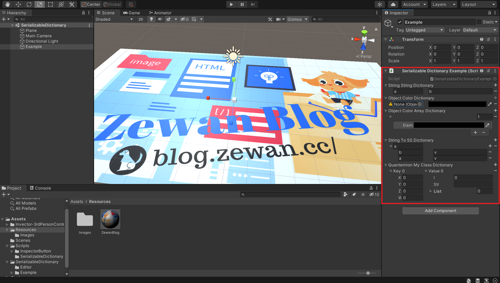

# Serializable Dictionaries

Unity 没有原生的字典类型可视化功能，本插件实现了字典类型 (Dictionary) 在 Inspector 的可视化。



## 代码架构

```shell
SerializableDictionary
│  README.md
│  SerializableDictionary.cs	# 工具实现细节
│  SerializableDictionary.unity	# demo scene
│
├─Editor
│      SerializableDictionaryPropertyDrawer.cs
│
└─Example
    │  SerializableDictionaryExample.cs	# 使用示例代码
    │  UserSerializableDictionaries.cs	# 定义字典类型
    │
    └─Editor
            UserSerializableDictionaryPropertyDrawers.cs
```

## 使用说明

1. 在 Example/UserSerializableDictionaries.cs 中按照示例添加自定义字典类型
2. 在 Example/Editor/UserSerializableDictionaryPropertyDrawers.cs 中按示例添加你前面创建的字典类型
3. 按照 Example/SerializableDictionaryExample.cs 的使用方法，在你需要的地方创建 MonoBehavior 类，添加相应字典类型。

