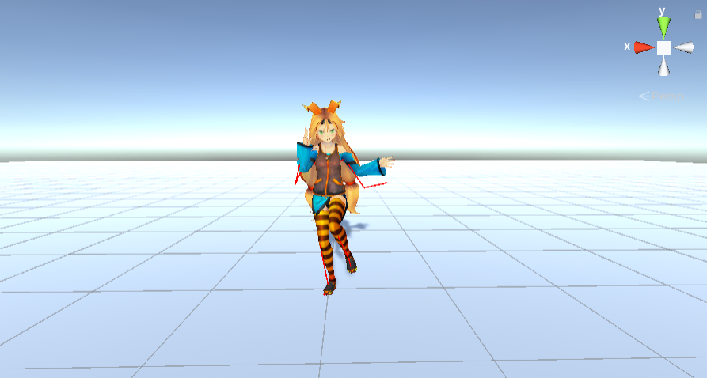
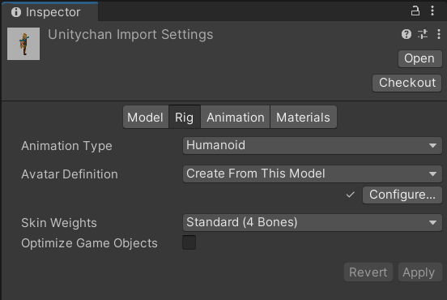
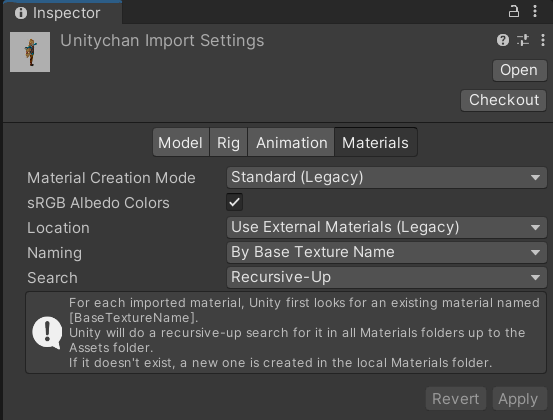

## BVHParser

理论原理与代码讲解见 [Unity 使用 bvh 驱动骨骼动作](https://blog.zewan.cc/2021/07/15/unity/unity-bvh/)

### 功能介绍

本模块实现了在 Unity 中使用 BVH 驱动人物模型完成相应动作。

### 如何使用

1. 下载本仓库项目，使用 Unity 打开

2. 创建人物模型：将人物模型 (.fbx / .prefab) 放入项目文件夹中，在 Unity 中点击，并在相应的 Inspector 面板中按下图设置，再拖入 Scene 中即可；模型可从 [Mixamo](https://www.mixamo.com/) 下载

   

   

3. 挂载脚本：点击新加入模型，点击 Add Component 添加 `BVHDriver.cs` 文件

4. 下载 BVH 文件：可以根据需要的动作查找 bvh 文件，常用的有 CMU 等

5. 编辑 Bonemaps：`Assets/Resources/Bonemaps.txt` 记录 bvh 各骨骼点与 Unity 内置骨骼点的对应关系，可根据 bvh 文件进行修改

6. 脚本设置：`filename` 为 bvh 文件路径，`TargetAvatar` 指定角色，可直接拖拽设置

**本仓库已导入两个人物模型，且挂载相应脚本，可直接运行观看展示效果。**

### 注意事项

- 确保 bvh 动捕数据第一帧为 Tpose
- 运行时 Scene 界面用红线画出了 bvh 动作骨架，可用以鉴别 bvh 动作是否导入成功
- 若使用的 bvh 文件的旋转量不是 `ZYX` 顺序，请相应修改 `BVHParser.cs` 中的 `eul2quat` 函数，一般只需调换该函数参数顺序即可