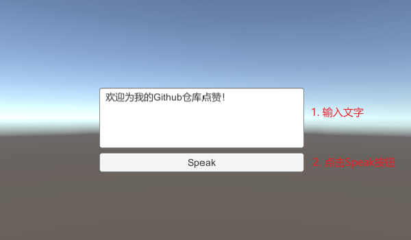

## UnityBaiduVoiceAPI

### 功能介绍

本模块在 Unity 中调用百度智能云的[语音识别](https://ai.baidu.com/ai-doc/SPEECH/Vk38lxily)和[语音合成](https://ai.baidu.com/ai-doc/SPEECH/Gk38y8lzk)接口，实现了语音识别为文字(ASR)和文字合成语音(TTS)的 Demo。

#### 语音识别ASR

#### 语音合成TTS

### 注意事项

- 调用百度智能云接口需要 `APIKey` 和 `SecretKey`，本仓库所用应用的可调用次数有限，若需要长期服务，请自行到百度智能云平台注册应用。
- 若需要以本仓库为基础进行开发，请参考 `AsrDemo.cs` 和 `TtsDemo.cs` 的代码写法，以及 Demo 场景中的配置方法。