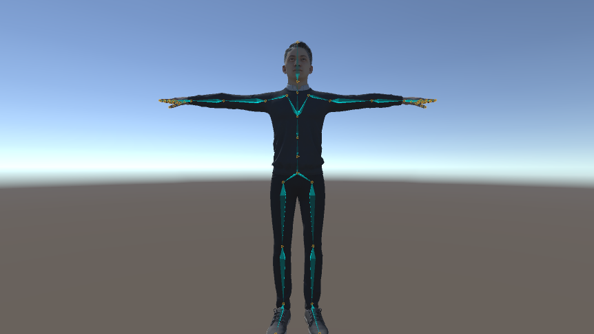

## AvatarVisualization

### 功能介绍

本模块实现了在 Unity 中对人物模型的骨架信息进行可视化。使用`UltiDraw`绘制包，绘制出人物的根节点 Root、骨架 Skeleton、骨骼点位置信息 Transforms。

### 如何使用

1. 下载本仓库项目，使用 Unity 打开
2. 创建人物模型：将人物模型 (.fbx / .prefab) 放入项目文件夹中，拖入 Scene 中；模型可从 [Mixamo](https://www.mixamo.com/) 下载

3. 挂载脚本：在人物根节点挂载 `Actor.cs` 文件，默认仅可视化骨架，可在 Inspector 面板中勾选其他。

### 注意事项

- 只有当人物模型所绑定的骨架符合正常的树结构时，可视化后的骨架才会正常。
- 应用本模块到新项目时，注意需要有 `Assets/Resources/UltiDraw.shader` 文件才能正常可视化。